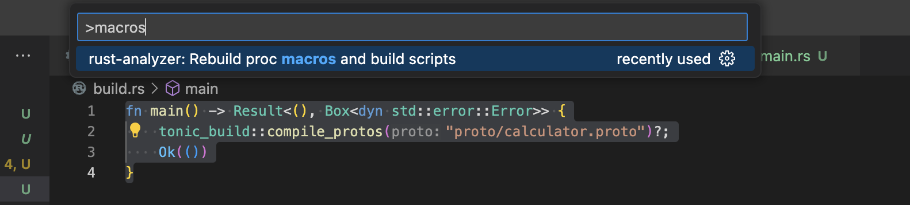
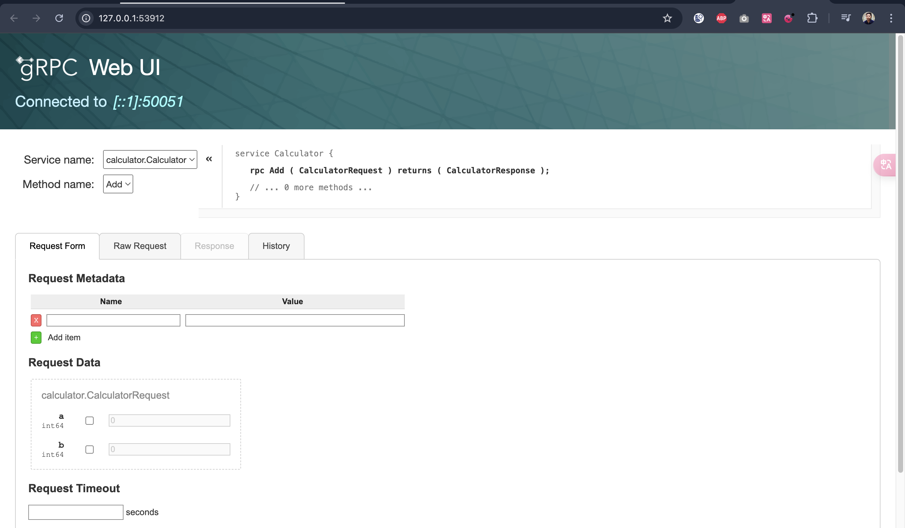
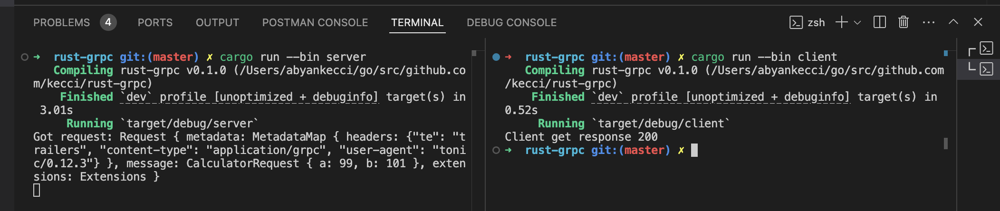

# Rust Grpc

## Generate Proto to Rust
1. Create build.rs
2. Then select the function on build.rs
3. Then Ctrl+P, and typ macros, they should be a `rust-analyzer: Rebuild proc macros and build scripts` and Enter. 
   
4. The proto is ready to use in rust code.

## How to use the proto on your code
```
// First, setup use mod proto
mod proto {
    tonic::include_proto!("calculator");
}

// Second, you could use import use proto::<your service>
use proto::calculator_server::{Calculator, CalculatorServer};
```

## Server
open new terminal, and run command :
```
cargo run
```
output when started :
```
    Finished `dev` profile [unoptimized + debuginfo] target(s) in 0.95s
     Running `target/debug/rust-grpc`
```
output if got request from client : (the client on the next step)
```
Got request: Request { metadata: MetadataMap { headers: {"content-type": "application/grpc", "user-agent": "grpcurl/1.9.1 grpc-go/1.61.0", "te": "trailers", "grpc-accept-encoding": "gzip"} }, message: CalculatorRequest { a: 1, b: 2 }, extensions: Extensions }
```

## Client (using grpcurl)
open new terminal, and run command :
```
grpcurl -plaintext -proto ./proto/calculator.proto -d '{"a": 1, "b": 2}' '[::1]:50051' calculator.Calculator.Add
```
output :
```
{
  "result": "3"
}
```

## Server (with GRPC Reflections)
if you want to list down all the grpc on the UI, you could check using grpcui. 

But you need extra adding the reflections also into your code.

If you not add the reflections to your code, you will getting this error :
```
➜  rust-grpc git:(master) ✗ grpcui -plaintext '[::1]:50051'     
Failed to compute set of methods to expose: server does not support the reflection API
```

After you add the reflections you could call grpcurl without the proto :
```
➜ grpcurl -plaintext -d '{"a": 1, "b": 2}' '[::1]:50051' calculator.Calculator.Add

{
  "result": "3"
}
```

You could also list down all available gRPC list :
```
➜ grpcurl -plaintext '[::1]:50051' list

calculator.Calculator
grpc.reflection.v1.ServerReflection
```

And also as mentioned before, we could open it via grpcui :
```
➜ grpcui -plaintext '[::1]:50051'
gRPC Web UI available at http://127.0.0.1:53912/
```



## Client (using Service)
In real-world, the service can communicate between them, so we will request and response between server & client.

run server in another terminal:
```
cargo run --bin server
```

run client in another terminal:
```
cargo run --bin client
```

capture: (left: server, right: client)


## Handling Error
> TBD

## Handling State
> TBD

## Interceptors
> TBD

## gRPC Web
> TBD

## References
- https://www.youtube.com/watch?v=kerKXChDmsE&t=296s
- https://www.youtube.com/watch?v=JkSa-qA2jnY